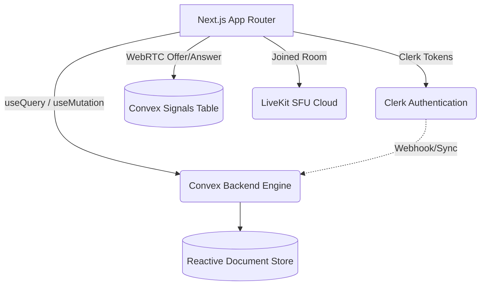

# 💬 Milan — Next-Gen Real-Time Messenger

<div align="center">
  
  
  
  
  
  
</div>

<br />

Welcome to **Milan** — a high-performance, real-time web chat application featuring private and group conversations, presence tracking, one-to-one video calls using WebRTC, and scalable group calls via LiveKit.

<details open>
<summary><b>📖 Table of Contents</b> <i>(Click to close/expand)</i></summary>

1. [✨ Key Features](#-key-features)
2. [🏗️ Architectural Overview](#-architectural-overview)
3. [🚀 Getting Started](#-getting-started)
4. [🗄️ Database Schema](#-database-schema)
5. [💡 Real-Time Engine Details](#-real-time-engine-details)
6. [👥 Calling & Video Strategy](#-calling--video-strategy)

</details>

---

## ✨ Key Features

| Feature Category | Capabilities included |
| --- | --- |
| **🛡️ Authentication** | Seamless & secure login via Clerk (Email & OAuth). Instant user sync to Convex. |
| **💬 Core Chat** | One-to-one messaging, group creation, emoji reactions, and soft deleting messages. |
| **🟢 Real-Time Engine** | Live Typing Indicators, Online/Offline Presence tracking, Unread badge counters. |
| **🎥 Video/Audio Calls** | Native Peer-to-Peer calls (`WebRTC` & Convex Signaling). Scalable group video chats (`LiveKit` SFU). |
| **🎨 UI/UX Excellence** | WhatsApp-style chat bubbles, auto-scroll to bottom, responsive mobile-first views using Tailwind CSS & shadcn/ui. |

---

## 🏗️ Architectural Overview

**Milan** combines local optimistic UI updates with a massively scalable reactive database framework (`Convex`).



---

## 🚀 Getting Started

<details>
<summary><b>🔍 Prerequisites</b> <i>(Click to expand)</i></summary>
You must have Node.js 20+ installed, along with accounts on <a href="https://clerk.dev" target="_blank">Clerk</a> and <a href="https://convex.dev" target="_blank">Convex</a>.
</details>

### 1. Clone & Install
```bash
git clone https://github.com/amit81127/Milan.git
cd Milan
npm install
```

### 2. Environment Configuration
Create a `.env.local` file at the root tracking these keys:
```env
NEXT_PUBLIC_CLERK_PUBLISHABLE_KEY="pk_test_..."
CLERK_SECRET_KEY="sk_test_..."

# Provided by running `npx convex dev`
NEXT_PUBLIC_CONVEX_URL="https://your-convex-instance.convex.cloud"

# (Optional) Provide LiveKit keys for group calls
LIVEKIT_API_KEY="..."
LIVEKIT_API_SECRET="..."
NEXT_PUBLIC_LIVEKIT_URL="..."
```

### 3. Run Development Servers
Start your real-time backend and Next.js frontend concurrently:
```bash
# Terminal 1: Starts the Convex development server & syncs schemas
npx convex dev

# Terminal 2: Starts the Next.js Frontend
npm run dev
```
Navigate to [`http://localhost:3000`](http://localhost:3000) to start chatting!

---

## 🗄️ Database Schema

The Convex NoSQL reactive tables defined in `schema.ts`:

- **`users`**: Manages profiles mapped to Clerk tokens, tracking `isOnline` and `lastSeen`.
- **`conversations` & `conversationMembers`**: Handles chat room groupings and keeps track of `lastReadTime` for unread badges.
- **`messages` & `reactions`**: Standard chat history tables with emoji reaction array maps.
- **`presence` & `typing`**: Heartbeat-based temporal tables indexing who is actively typing in which conversation.
- **`calls` & `signals`**: Deep WebRTC integration tracking session descriptions and hardware signaling paths.

---

## 💡 Real-Time Engine Details

### Presence & Typing
Instead of heavy WebSocket `socket.io` manually bound listeners, Milan leverages **Convex Subscriptions**:
1. When a user types, a Next.js mutation sets a timestamp in the `typing` table.
2. The UI natively subscribes to the `typing` table via `useQuery()`.
3. If `< 3 seconds` passed since update, the "User is typing..." badge visibly animates locally.

---

## 👥 Calling & Video Strategy

Milan handles Audio & Video scaling elegantly by routing between two distinct engines:

<details>
<summary><b>📞 1-to-1 Calls (Native WebRTC & Convex Signaling)</b></summary>
Handled in <code>components/chat/VideoCall.tsx</code>. A true peer-to-peer mesh networking approach. Convex is exclusively used to swap ICE Candidates and Session Descriptions. This eliminates heavy media routing costs for 1-to-1 interactions!
</details>

<details>
<summary><b>🌐 Group Calls (LiveKit SFU)</b></summary>
Handled in <code>components/chat/LiveKitGroupCall.tsx</code>. When 3+ people connect, Peer-to-Peer becomes CPU/Network heavy. Milan seamlessly falls back to the LiveKit Selective Forwarding Unit (SFU) pattern, routing through <code>@livekit/components-react</code> grids for high performance.
</details>

<br/>

---

<p align="center">
  <i>Developed for portfolio to showcase mastery of modern frontend and complex real-time distributed capabilities.</i><br/>
  <b>Amit Kumar</b> • <a href="https://github.com/amit81127">GitHub Profile</a>
</p>